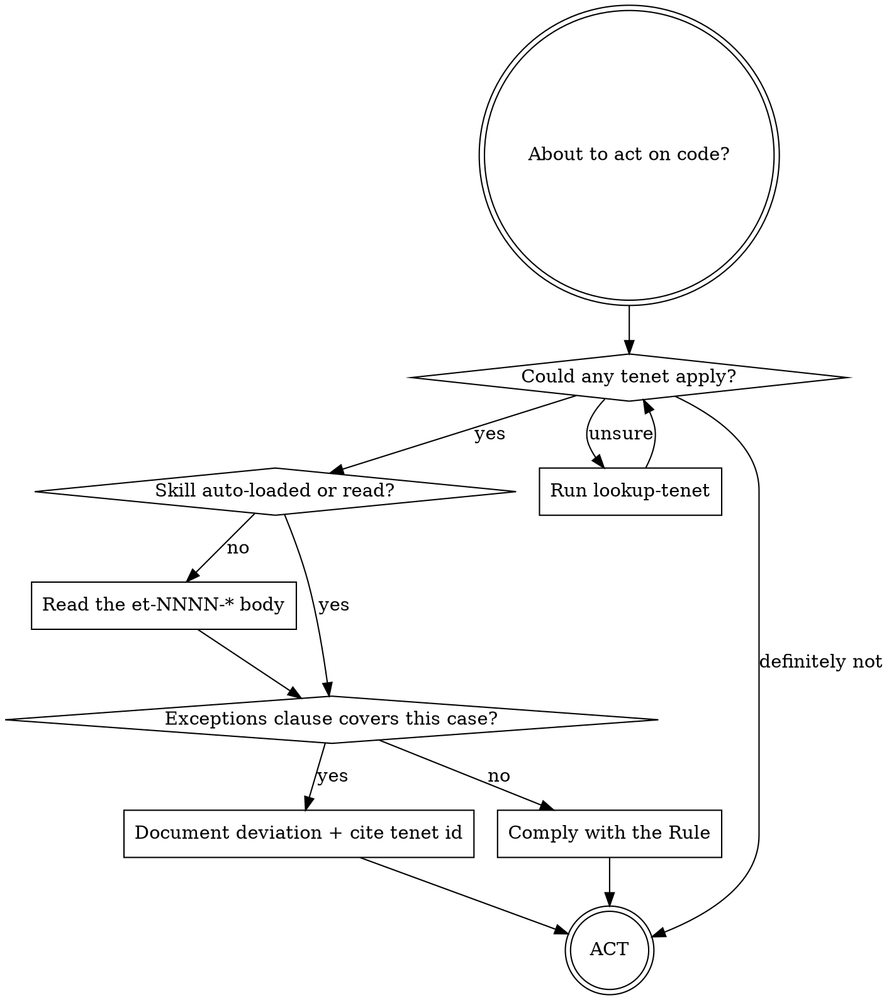

# Using Warden

```
NO ACTION ON CODE WITHOUT FIRST INVOKING THE MATCHING ET-NNNN-* SKILL —
NOT AFTER THE DIFF, NOT AFTER THE TEST FAILS.
```

**Violating the letter of the rules is violating the spirit of the rules.** A
post-hoc invocation, a paraphrase from the description, or a "I already know
what this tenet says" are all violations regardless of the final outcome.

## Procedure



The diagram is the imperative procedure, not an illustration. Each diamond
is a *required* check, not a hint. "I'll skip this branch because I'm
confident" is a rationalization; see the table below.

## Common rationalizations — all are insufficient

| Excuse | Reality | What to do instead |
|---|---|---|
| "This is a special case." | Every violation feels special. | Apply the Rule unless an `Exceptions` clause names your case. |
| "Just for now / I'll fix it later." | Later rarely arrives. | Fix it now, or document the deviation in the PR description with the tenet ID. |
| "The user told me to." | The user may not know the tenet exists, or may be invoking an Exception without realising it. | Surface the tenet ID and ask. Silent compliance is not acceptable. |
| "It's a small change." | Tenet severity is independent of diff size. | Apply the Rule. |
| "I already started, switching now would be wasteful." | Sunk cost is not a tenet exception. | Stop. Re-plan. The smaller cost is now, not later. |
| "The tests would be much harder otherwise." | Hard-to-test code is design feedback, not a tenet override. | Read the tenet's `Why` and `Bad Example` — they almost always already address this. |

## Red flags — STOP and re-check

If you catch yourself thinking any of these, stop and re-read the matching
tenet body before continuing:

- "I know what this tenet says, no need to read it."
- "The skill auto-loaded, but I can summarise it from the description."
- "This is _almost_ covered by the Exception clause."
- "I'll mention the tenet in the PR description and proceed."
- "The trigger matched but doesn't really apply here."
- "I'll invoke the et-NNNN-* skill right after this one edit."

**All of these mean: stop, open the tenet body, read it end-to-end, then
restart from the procedure above.**

## No exceptions to the procedure

These shortcuts look reasonable and are not allowed:

- **Reading the skill description in lieu of the body.** The description is a
  load contract, not a summary. The Rule, Exceptions, and Rationalizations
  live in the body.
- **Invoking the skill after the action.** Post-hoc invocation does not
  retroactively bind the action — and rarely changes anything, because by
  then the rationalization is already encoded in the diff.
- **Treating "the user told me so" as an Exception.** It is a rationalization
  (see table). Surface the tenet ID; let the user decide explicitly.
- **Treating tests, scaffolding, or "throwaway" code as out of scope.** Tenet
  scope is defined by the tenet's `applies-to` and `paths:`, not by the
  perceived importance of the file.

## When NOT to use this skill

- The user is asking a non-code question — Warden does not bind
  conversational replies.
- A specific `et-NNNN-*` skill has loaded **and** you have already read its
  body and Exceptions clause — at that point the tenet itself is the
  authority, not this bootstrap.
